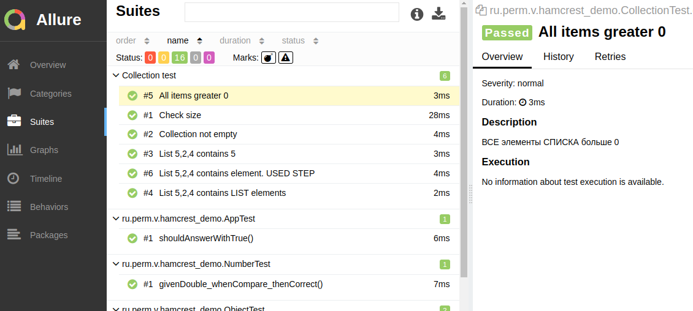
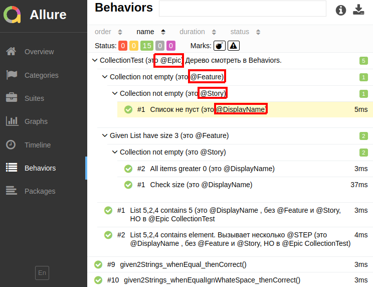

## Hamcrest test и Allure Report

Hamcrest помогает писать тесты. Не надо путать его с полнофункциональными фреймворками для тестирования, 
такими как JUnit. Hamcrest – это всего лишь **БИБЛИОТЕКА MATCHER-ов**, которая используется в паре с JUnit 
или другим аналогичным фреймворком для тестирования.

Зачем же нужен Hamcrest, если есть assert-ы JUnit? 
В Hamcrest составлять проверки удобнее, а главное, они более читаемые.

Возвращаемые тексты ошибок тоже скажут больше о проблеме.

[https://sysout.ru/rabota-s-hamcrest/](https://sysout.ru/rabota-s-hamcrest/)

Тот самый Vogella
[https://www.vogella.com/tutorials/Hamcrest/article.html](https://www.vogella.com/tutorials/Hamcrest/article.html)

### Проведение тестов и просмотр отчета в формате Allure

```shell
mvn clean test
mvn io.qameta.allure:allure-maven:serve
```

Результаты тестов будут в папке target/allure-results/

### Шпаргалка по аннотациям Allure Reports

Иерархия такая @Epic -> @Feature -> @Story -> @Step



Вложенность тестов


